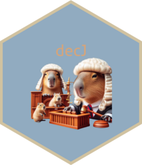

<!-- README.md is generated from README.Rmd. Please edit that file -->

```{r, include = FALSE}
knitr::opts_chunk$set(
  collapse = TRUE,
  warning = FALSE,
  error = FALSE,
  message = FALSE,
  comment = "#>",
  fig.path = "man/figures/README-",
  out.width = "100%"
)
```

# decJ 

<!-- badges: start -->
[](https://img.shields.io/github/license/johnmbf/decJ)
[](https://img.shields.io/github/v/release/johnmbf/decJ)
[](https://zenodo.org/doi/10.5281/zenodo.10910046)
[](https://github.com/johnmbf/decJ/actions/workflows/R-CMD-check.yaml)
<!-- badges: end -->

## Resumo

O pacote decJ tem como objetivo auxiliar as pesquisas envolvendo tribunais. Atualmente temos funções para o Supremo Tribunal Federal e para o Tribunal de Justiça do Estado do Rio Grande do Sul.

## Instalação

Você pode baixar a versão de desenvolvedor em [GitHub](https://github.com/johnmbf/decJ) com:

``` r
# install.packages("devtools")
devtools::install_github("johnmbf/decJ")
```

## Tutorial

... já já 

## Referência

Para citar o pacote decJ em publicações, utilize:

FERREIRA, Jonathan Morais Barcellos. decJ: Auxílio em pesquisas com processos e decisões judiciais. Versão 1.0.0. Rio Grande, 2023. Disponível em: doi:10.5281/zenodo.10910047.

Se preferir, em bibTex, utilize:

```bibtex
@software{,
    title = {decJ: Auxílio em pesquisas com processos e decisões judiciais},
    author = {Jonathan Morais Barcellos Ferreira},
    year = {2023},
    version = {1.0.0},
    doi = {10.5281/zenodo.10910047},
  }
```

